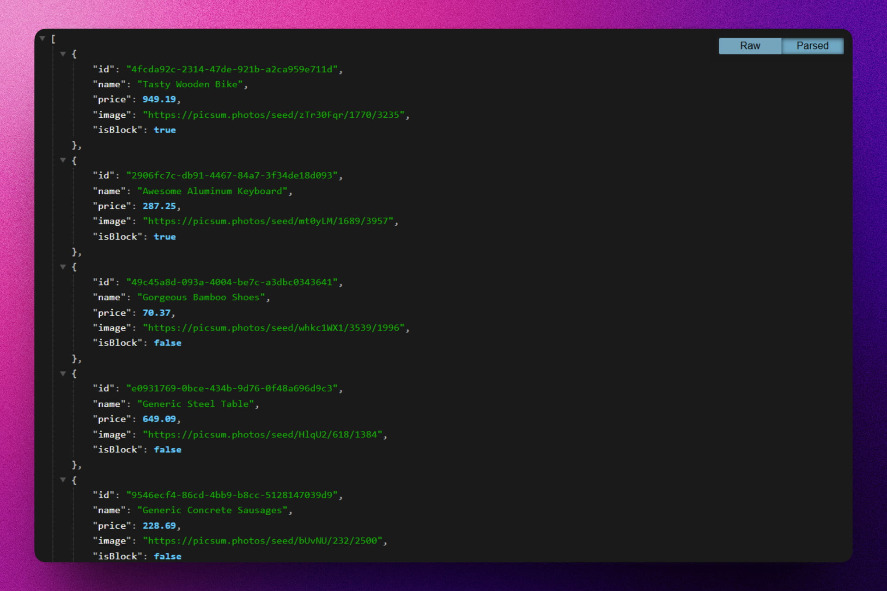

<div align='center'>

# 💽 NODE/EXPRESS: Simple Store API

</div>

### API para gestionar productos de una tienda.

> 🧩 Aquí puedes ver su [**Live Demo.**](https://simple-store-api-abrahamgalue.vercel.app/api/v1/products)



## 🚀 Descripción

Este proyecto es el resultado de un curso completo de Node.js que realicé. Se trata de una API que permite gestionar el inventario de productos para una tienda virtual, utilizando datos simulados generados dinámicamente.

## ⚡ Comenzar

### Prerrequisitos

1. Git.
2. Node.js: cualquier versión a partir de la 20 o superior.
3. pnpm (recomendado)

## 🔧 Instalación

### Usando pnpm

1. **Clona el repositorio:**

   ```bash
   git clone https://github.com/abrahamgalue/simple-store-api.git
   cd simple-store-api
   ```

2. **Instala las dependencias:**

   ```bash
   pnpm install
   ```

### Ejecución local (modo desarrollo)

1. **Inicia el servidor de desarrollo:**

   ```bash
   pnpm run dev
   ```

   Esto iniciará el servidor de desarrollo utilizando `tsx` y tu aplicación estará disponible en `http://localhost:3000`.

## 🎭 Tecnologías

El proyecto utiliza las siguientes tecnologías:

- [**Express**](https://expressjs.com/) como framework de Node.js.
- [**TypeScript**](https://www.typescriptlang.org/) para el desarrollo con tipado estático.
- [**Faker JS**](https://fakerjs.dev/) para generar datos aleatorios y realistas.
- [**Joi**](https://joi.dev/) para la validación de esquemas de datos.
- [**Boom**](https://hapi.dev/module/boom/) para el manejo de errores HTTP.
- [**CORS**](https://github.com/expressjs/cors) para gestionar el acceso desde diferentes dominios.
- [**Vercel**](https://vercel.com/home) para el despliegue de la aplicación.
